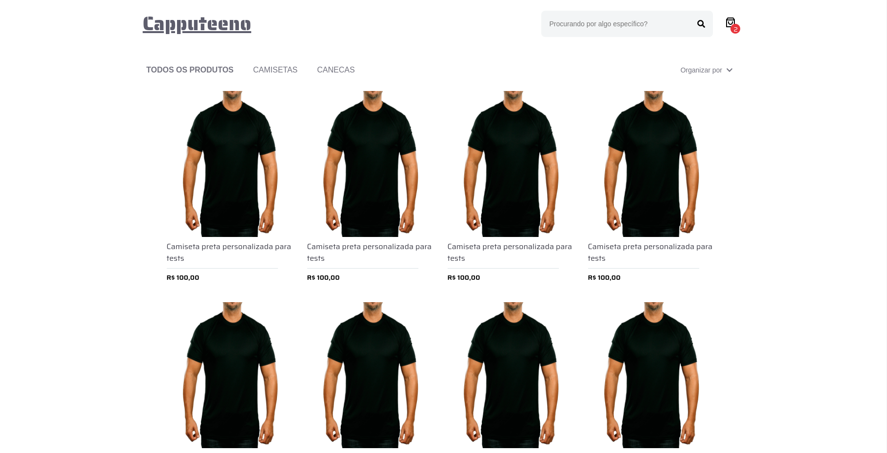

## Desafio Front-end Capputeeno



### 🛠 Tecnologias

As seguintes ferramentas foram usadas na construção do projeto:

- [Next](https://nextjs.org/)
- [React](https://pt-br.reactjs.org/)
- [Styled components](https://styled-components.com/)
- [TypeScript](https://www.typescriptlang.org/)

Para rodar aplicação:

```bash
npm run dev
```

